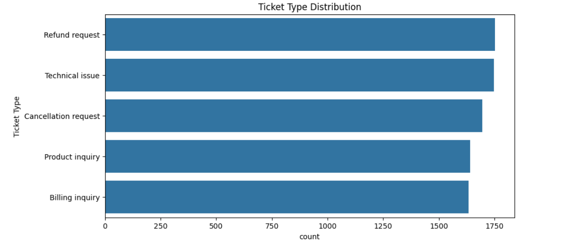

# Customer Support Data Analysis

## Overview
This project analyzes customer support tickets to identify common issues, response time trends, and areas for improvement in ticket resolution efficiency. The insights help optimize customer service operations by addressing key concerns such as ticket volume, resolution time, and customer satisfaction.

## Features
- Analysis of **customer satisfaction ratings** to assess feedback trends.
- Examination of **ticket type distribution** to highlight common customer concerns.
- Insights into **response time trends** to evaluate efficiency improvements.
- Recommendations for **enhancing customer support** through automation and self-service options.

## Data Insights
### Customer Satisfaction Ratings
- **67.3% of customers** did not provide a rating, indicating low engagement in feedback collection.
- Low ratings (**1-2 stars**) account for **12.9%**, suggesting areas for service enhancement.
- Ratings are fairly balanced, with no extreme variations in customer sentiment.

### Ticket Type Distribution
- **Refund requests** and **technical issues** make up the largest proportion of tickets.
- **Billing and product inquiries** are significant contributors to customer queries.
- A noticeable percentage of **cancellation requests** suggests potential dissatisfaction with services.

### Response Time Trends
- Average response time has decreased from **~12 hours to ~8 hours**, reflecting improved efficiency.
- A consistent downward trend suggests better workflow management and resource allocation.

## Recommendations
- Implement **automated follow-ups** to increase customer feedback response rates.
- Prioritize **low-rated interactions** to improve service recovery and customer satisfaction.
- Deploy an **AI chatbot** for handling common inquiries to reduce ticket volume.
- Enhance **self-service support** through better documentation and FAQs.
- Optimize **refund processing workflows** with automation for quicker resolutions.

## Technologies Used
- **Python & Pandas** for data analysis.
- **Matplotlib & Seaborn** for data visualization.
- **Jupyter Notebook** for interactive exploration.

## How to Use
1. Clone the repository and install required dependencies.
2. Load the dataset into the analysis notebook.
3. Run the exploratory data analysis (EDA) scripts.
4. Visualize key insights and generate reports.

## Visualizations

Here are some key visualizations from the analysis:

### 1. Ticket Type Distribution  

### 2. Most Common Words in Ticket Distribution  

### 3. Distribution of Customer Satisfaction  

### 4. Chance of Resolution  

## Conclusion
This project provides actionable insights to enhance customer support efficiency and improve satisfaction. By leveraging automation, self-service options, and proactive engagement strategies, businesses can optimize their support operations effectively.

